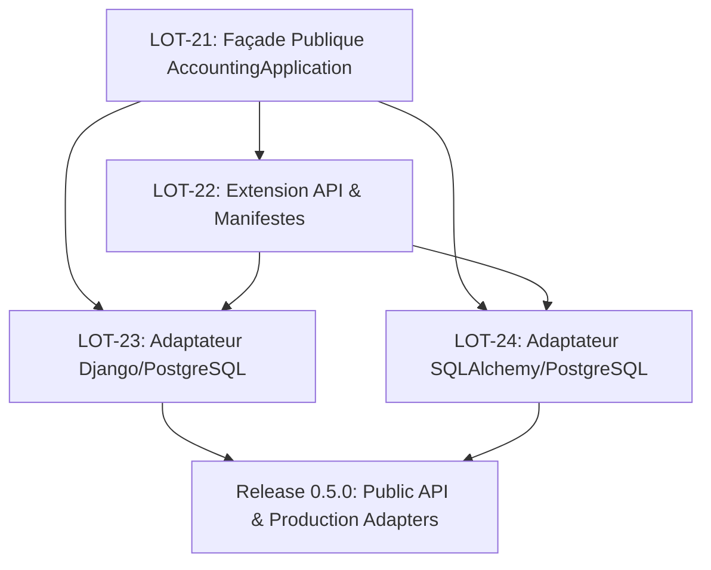

# PLAN-05 : Façade Publique, Extension API & Adaptateurs de Production (Release 0.5.0)

Ce plan d'implémentation opérationnel couvre les lots **LOT-21 à LOT-24** de la [Roadmap](../ROADMAP.md). Il formalise la stabilisation de l'API publique `AccountingApplication`, la publication des manifestes de compatibilité et l'implémentation des adaptateurs de persistance PostgreSQL de référence (Django et SQLAlchemy).

---

## 1. Contexte & Spécifications de Référence

- **Specs applicables** :
  - Architecture applicative & ports/adaptateurs : [`01_PYACCOUNTINGKIT_PROJECT_VISION_AND_ARCHITECTURE.md`](../specs/00_cadrage/01_PYACCOUNTINGKIT_PROJECT_VISION_AND_ARCHITECTURE.md)
  - Modèle de domaine et frontières : [`02_PYACCOUNTINGKIT_DOMAIN_MODEL_AND_BOUNDED_CONTEXTS.md`](../specs/00_cadrage/02_PYACCOUNTINGKIT_DOMAIN_MODEL_AND_BOUNDED_CONTEXTS.md)
  - Persistance, concurrence et transactions : [`10_PYACCOUNTINGKIT_PERSISTENCE_CONCURRENCY_AND_ADAPTER_CONTRACTS.md`](../specs/04_integration-infra/10_PYACCOUNTINGKIT_PERSISTENCE_CONCURRENCY_AND_ADAPTER_CONTRACTS.md)
  - Surfaces publiques & API Design : [`16_PYACCOUNTINGKIT_PUBLIC_API_DESIGN.md`](../specs/04_integration-infra/16_PYACCOUNTINGKIT_PUBLIC_API_DESIGN.md)
  - Stratégie de release & compatibilité : [`17_PYACCOUNTINGKIT_RELEASE_AND_VERSIONING_STRATEGY.md`](../specs/05_engineering-governance/17_PYACCOUNTINGKIT_RELEASE_AND_VERSIONING_STRATEGY.md)
  - Stratégie de test : [`11_PYACCOUNTINGKIT_TESTING_AND_QUALITY_STRATEGY.md`](../specs/05_engineering-governance/11_PYACCOUNTINGKIT_TESTING_AND_QUALITY_STRATEGY.md)
- **Doctrine comptable & Référentiels de conformité** :
  - 📖 [`Comptabilite_Generale_Systeme_Francais_et_Normes_IFRS.md`](../books/Comptabilite_Generale_Systeme_Francais_et_Normes_IFRS.md) (Garantie de non-altération du domaine comptable par les couches de transport et d'infrastructure).
  - 🏛️ Schémas JSON de validation : [`docs/referentiels/schemas/`](../referentiels/schemas/) (validation structurelle des DTOs et contrats d'échange).
- **Codebase cible & Modèles ORM de référence** :
  - 🏛️ Applications CFA FRA : [`resources/cfa_fra_django_mvp_sprint_7/apps/`](../../resources/cfa_fra_django_mvp_sprint_7/apps/) (référence réelle pour l'implémentation de l'adaptateur ORM Django / PostgreSQL).

---

## 2. Inventaire des Fichiers à Implémenter & Liens Relatifs

### 2.1. Façade Publique & DTOs (`public`)
- Point d'entrée unique de la bibliothèque :
  - [`src/pyaccountingkit/public/application.py`](../../src/pyaccountingkit/public/application.py) (`AccountingApplication`)
  - [`src/pyaccountingkit/public/context.py`](../../src/pyaccountingkit/public/context.py) (`CommandContext` : tenant_id, user_id, correlation_id)
  - [`src/pyaccountingkit/public/pagination.py`](../../src/pyaccountingkit/public/pagination.py) (`Page[T]`, `Cursor`)
  - [`src/pyaccountingkit/public/errors.py`](../../src/pyaccountingkit/public/errors.py) (`PublicAccountingError` avec code machine)
- DTOs publics immuables :
  - [`src/pyaccountingkit/public/dto/entry.py`](../../src/pyaccountingkit/public/dto/entry.py) (`JournalEntryDTO`, `CreateEntryCommand`)
  - [`src/pyaccountingkit/public/dto/ledger.py`](../../src/pyaccountingkit/public/dto/ledger.py) (`TrialBalanceDTO`, `GeneralLedgerReportDTO`)
  - [`src/pyaccountingkit/public/dto/statement.py`](../../src/pyaccountingkit/public/dto/statement.py) (`FinancialStatementDTO`)
- Protocoles d'extension :
  - [`src/pyaccountingkit/public/protocols/unit_of_work.py`](../../src/pyaccountingkit/public/protocols/unit_of_work.py) (`UnitOfWorkFactoryProtocol`)
  - [`src/pyaccountingkit/public/protocols/references.py`](../../src/pyaccountingkit/public/protocols/references.py) (`ReferenceProviderExtensionProtocol`)

### 2.2. Adaptateur Django / PostgreSQL (`adapters/django`)
- Modèles et gestion de la concurrence :
  - [`src/pyaccountingkit/adapters/django/models.py`](../../src/pyaccountingkit/adapters/django/models.py) (Modèles ORM Django PostgreSQL)
  - [`src/pyaccountingkit/adapters/django/mappers.py`](../../src/pyaccountingkit/adapters/django/mappers.py) (Conversion stricte `DjangoModel <-> DomainEntity`)
  - [`src/pyaccountingkit/adapters/django/repositories.py`](../../src/pyaccountingkit/adapters/django/repositories.py) (`DjangoJournalEntryRepository`)
  - [`src/pyaccountingkit/adapters/django/unit_of_work.py`](../../src/pyaccountingkit/adapters/django/unit_of_work.py) (`DjangoUnitOfWork` basé sur `transaction.atomic`)

### 2.3. Adaptateur SQLAlchemy / PostgreSQL (`adapters/sqlalchemy`)
- Définition déclarative et Session UoW :
  - [`src/pyaccountingkit/adapters/sqlalchemy/tables.py`](../../src/pyaccountingkit/adapters/sqlalchemy/tables.py) (Schémas Declarative 2.0)
  - [`src/pyaccountingkit/adapters/sqlalchemy/mappers.py`](../../src/pyaccountingkit/adapters/sqlalchemy/mappers.py) (Mappers sans fuite d'état ORM)
  - [`src/pyaccountingkit/adapters/sqlalchemy/repositories.py`](../../src/pyaccountingkit/adapters/sqlalchemy/repositories.py) (`SQLAlchemyJournalEntryRepository`)
  - [`src/pyaccountingkit/adapters/sqlalchemy/unit_of_work.py`](../../src/pyaccountingkit/adapters/sqlalchemy/unit_of_work.py) (`SessionUnitOfWork`)

### 2.4. Manifestes Machine-Readable (Racine)
- Fichiers d'inventaire d'API et de compatibilité :
  - [`PUBLIC_API_MANIFEST.json`](../../PUBLIC_API_MANIFEST.json) (Contrat formel de surface publique)
  - [`PUBLIC_ERROR_CODES.json`](../../PUBLIC_ERROR_CODES.json) (Index des codes d'erreurs publics)
  - [`ADAPTER_CONTRACT_MANIFEST.json`](../../ADAPTER_CONTRACT_MANIFEST.json) (Version de contrat d'adaptateur v1)

### 2.5. Suites de Tests Associées (`tests`)
- Tests unitaires et d'intégration :
  - [`tests/unit/public/test_application_facade.py`](../../tests/unit/public/test_application_facade.py)
  - [`tests/integration/test_django_adapter.py`](../../tests/integration/test_django_adapter.py)
  - [`tests/integration/test_sqlalchemy_adapter.py`](../../tests/integration/test_sqlalchemy_adapter.py)
- Tests de concurrence PostgreSQL (Testcontainers) :
  - [`tests/concurrency/test_postgres_concurrency.py`](../../tests/concurrency/test_postgres_concurrency.py)

---

## 3. Détails Techniques & Extraits de Code Concrets

### 3.1. Façade Publique `AccountingApplication` (`src/pyaccountingkit/public/application.py`)

```python
from __future__ import annotations

from typing import Any
from pyaccountingkit.ports.unit_of_work import UnitOfWorkProtocol
from pyaccountingkit.ports.references import AccountingReferenceProviderProtocol
from pyaccountingkit.public.context import CommandContext
from pyaccountingkit.public.dto.entry import JournalEntryDTO, CreateEntryCommand
from pyaccountingkit.domain.ledger.posting import PostingService
from pyaccountingkit.core.clock import SystemClock


class EntriesFacade:
    """Namespace d'API pour la gestion des écritures comptables."""

    def __init__(self, uow: UnitOfWorkProtocol, clock: Any) -> None:
        self._uow = uow
        self._clock = clock

    def create_and_post(self, cmd: CreateEntryCommand, ctx: CommandContext) -> JournalEntryDTO:
        with self._uow:
            period = self._uow.periods.get_by_date(cmd.entry_date)
            # Conversion de commande DTO en entité de domaine
            domain_entry = cmd.to_domain()
            service = PostingService(self._clock, self._uow.audit)
            posted_entry = service.post(domain_entry, period, user_id=ctx.actor_id)
            self._uow.entries.save(posted_entry)
            self._uow.commit()
            return JournalEntryDTO.from_domain(posted_entry)


class AccountingApplication:
    """Point d'entrée unique de PyAccountingKit pour les consommateurs externes."""

    def __init__(
        self,
        uow_factory: Any,
        reference_provider: AccountingReferenceProviderProtocol,
        clock: Any = None,
    ) -> None:
        self._uow_factory = uow_factory
        self._ref_provider = reference_provider
        self._clock = clock or SystemClock()
        self.entries = EntriesFacade(self._uow_factory(), self._clock)
```

### 3.2. Dépôt Django & Verrouillage Concurrence (`src/pyaccountingkit/adapters/django/repositories.py`)

```python
from __future__ import annotations

from django.db import transaction
from pyaccountingkit.core.identifiers import EntryId
from pyaccountingkit.domain.journals.journal_entry import JournalEntry
from pyaccountingkit.adapters.django.models import EntryModel
from pyaccountingkit.adapters.django.mappers import entry_to_domain, domain_to_model


class DjangoJournalEntryRepository:
    """Dépôt Django avec protection stricte contre les courses critiques."""

    def get_for_update(self, entry_id: EntryId) -> JournalEntry | None:
        """Sélectionne avec verrou pessimiste d'écriture (SELECT FOR UPDATE)."""
        try:
            model = (
                EntryModel.objects.select_for_update()
                .prefetch_related("lines")
                .get(id=str(entry_id))
            )
            return entry_to_domain(model)
        except EntryModel.DoesNotExist:
            return None

    def save(self, entry: JournalEntry) -> None:
        model = domain_to_model(entry)
        model.save()
        for line in entry.lines:
            # Sauvegarde des lignes associées
            ...
```

### 3.3. Test de Concurrence PostgreSQL (`tests/concurrency/test_postgres_concurrency.py`)
Ce test valide qu'une tentative de clôture de période concurrente à une comptabilisation s'arbitre proprement sans laisser d'écritures invalides.

```python
import threading
from pyaccountingkit.core.errors import PeriodClosedError


def test_posting_vs_closing_race(django_app, test_period, sample_command, context):
    """Vérifie la robustesse face à une course comptabilisation vs clôture."""
    errors = []

    def run_posting():
        try:
            for _ in range(50):
                django_app.entries.create_and_post(sample_command, context)
        except PeriodClosedError as e:
            errors.append(e)

    def run_closing():
        django_app.closing.close_period(test_period.id, context)

    t1 = threading.Thread(target=run_posting)
    t2 = threading.Thread(target=run_closing)

    t1.start()
    t2.start()
    t1.join()
    t2.join()

    # Toutes les écritures ayant réussi doivent être antérieures au scellement de la période
    assert all(isinstance(e, PeriodClosedError) for e in errors)
```

## 4. Ordonnancement des Lots & Dépendances

### Aperçu Schématique (Vue ASCII Textuelle)

```text
┌────────────────────────────────────────────────────────┐
│      LOT-21 : Façade Publique AccountingApplication    │
└───────────────┬────────────────────────┬───────────────┘
                │                        │
                ▼                        ▼
┌───────────────────────────────┐ ┌───────────────────────────────┐
│ LOT-22 : Extension API        │ │ LOT-23 : Adaptateur Django    │
│ & Manifestes (GAPI)           │ │ & Concurrence PostgreSQL (GP) │
└───────────────┬───────────────┘ └──────────────┬────────────────┘
                │                                │
                ▼                                │
┌───────────────────────────────┐                │
│ LOT-24 : Adaptateur           │                │
│ SQLAlchemy PostgreSQL (GP)    │                │
└───────────────┬───────────────┘                │
                │                                │
                └───────────────┬────────────────┘
                                │
                                ▼
┌────────────────────────────────────────────────────────┐
│     Release 0.5.0 : Public API & Production Adapters   │
└────────────────────────────────────────────────────────┘
```

### Définition Formelle Mermaid (pour viewers avec extension)



---

## 5. Matrice des Gates & Critères de Qualité

- **`GAPI` (Public API Surface Gate)** :
  - Aucun objet ORM (`django.db.models.Model`, `sqlalchemy.orm.DeclarativeBase`) ne doit fuiter hors de la façade.
  - Tous les DTOs publics retournés sont immuables (`frozen=True`).
- **`GP` (PostgreSQL Concurrency Gate)** :
  - Réussite des suites de concurrence sur un cluster PostgreSQL réel (testcontainers).
  - Prévention totale des interblocages (*deadlocks*) par ordonnancement univoque des verrous par clé primaire.

---

## 5. Definition of Done (DoD Spécifique)

- [ ] La façade `AccountingApplication` expose l'intégralité des fonctionnalités prévues (écritures, grand livre, clôtures, états).
- [ ] Les manifestes `PUBLIC_API_MANIFEST.json` et `PUBLIC_ERROR_CODES.json` sont générés et versionnés.
- [ ] L'adaptateur `django` passe 100 % de la suite de conformité des dépôts sous PostgreSQL.
- [ ] L'adaptateur `sqlalchemy` passe 100 % de la suite de conformité sous PostgreSQL.
- [ ] L'installation isolée de `pyaccountingkit` pur fonctionne sans warning de dépendance d'ORM manquante.

---

## 6. Procédure de Recette Exécutable

```bash
# Tests unitaires de la façade publique
pytest tests/unit/public/ -v

# Tests d'intégration des adaptateurs PostgreSQL réels
pytest tests/integration/test_django_adapter.py -v
pytest tests/integration/test_sqlalchemy_adapter.py -v
pytest tests/concurrency/test_postgres_concurrency.py -v

# Contrôle du manifeste d'API publique
python scripts/verify_api_manifest.py

# Typage strict
mypy src/pyaccountingkit/public src/pyaccountingkit/adapters
```
