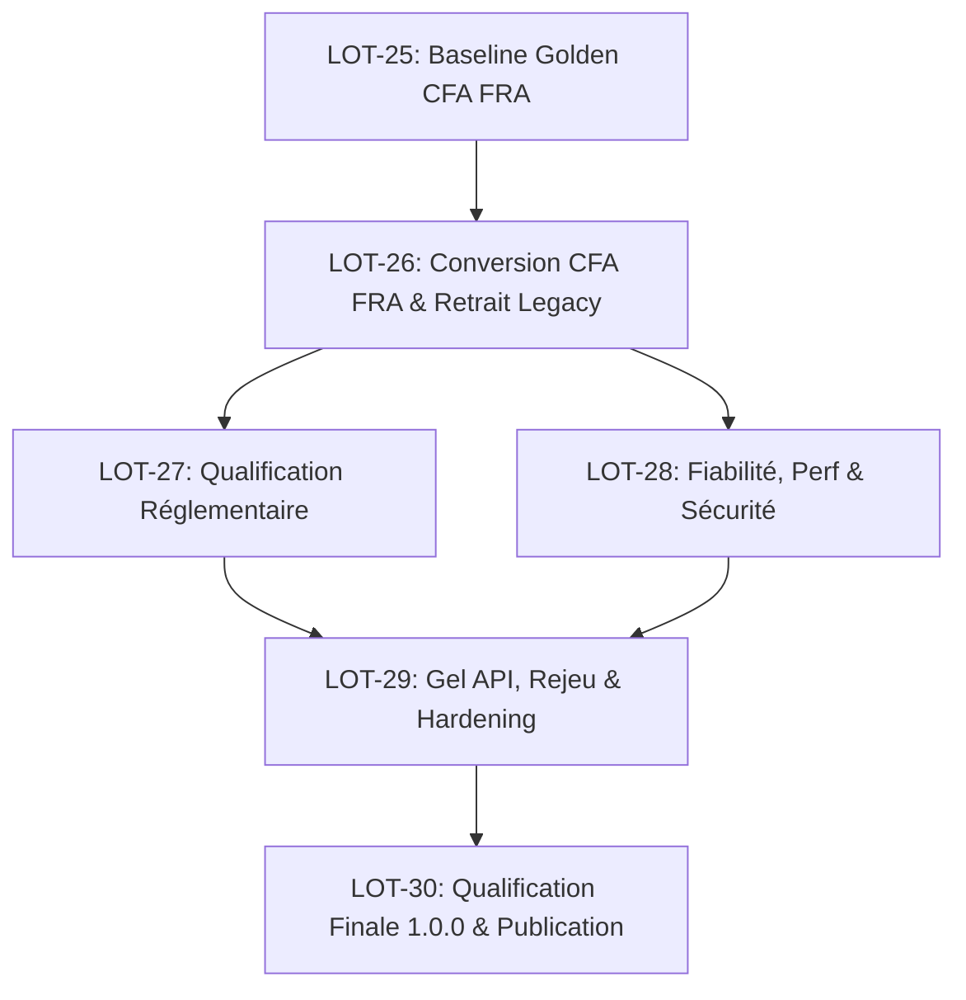

# PLAN-06 : Hardening, Migration CFA FRA & Release 1.0.0

Ce plan d'implémentation opérationnel couvre les lots **LOT-25 à LOT-30** de la [Roadmap](../ROADMAP.md). Il formalise la migration du moteur comptable historique de CFA FRA via le pattern Strangler Fig, la qualification de parité au centime près, les tests de résistance en charge et le gel d'API de la version majeure stable `1.0.0`.

---

## 1. Contexte & Spécifications de Référence

- **Specs applicables** :
  - Extraction et plan de migration CFA FRA : [`18_PYACCOUNTINGKIT_CFA_FRA_EXTRACTION_AND_MIGRATION_MAP.md`](../specs/04_integration-infra/18_PYACCOUNTINGKIT_CFA_FRA_EXTRACTION_AND_MIGRATION_MAP.md)
  - Feuille de route d'implémentation : [`../ROADMAP.md`](../ROADMAP.md)
  - Règles doctrinales & invariants : [`03_PYACCOUNTINGKIT_ACCOUNTING_RULES_AND_INVARIANTS.md`](../specs/01_core-accounting/03_PYACCOUNTINGKIT_ACCOUNTING_RULES_AND_INVARIANTS.md)
  - Matrice d'intégration réglementaire : [`19_PYACCOUNTINGKIT_REGULATORY_FRAMEWORK_INTEGRATION_MATRIX.md`](../specs/04_integration-infra/19_PYACCOUNTINGKIT_REGULATORY_FRAMEWORK_INTEGRATION_MATRIX.md)
  - Persistance, concurrence & adaptateurs : [`10_PYACCOUNTINGKIT_PERSISTENCE_CONCURRENCY_AND_ADAPTER_CONTRACTS.md`](../specs/04_integration-infra/10_PYACCOUNTINGKIT_PERSISTENCE_CONCURRENCY_AND_ADAPTER_CONTRACTS.md)
  - Stratégie de test & qualification : [`11_PYACCOUNTINGKIT_TESTING_AND_QUALITY_STRATEGY.md`](../specs/05_engineering-governance/11_PYACCOUNTINGKIT_TESTING_AND_QUALITY_STRATEGY.md)
  - Gouvernance de release & versioning : [`17_PYACCOUNTINGKIT_RELEASE_AND_VERSIONING_STRATEGY.md`](../specs/05_engineering-governance/17_PYACCOUNTINGKIT_RELEASE_AND_VERSIONING_STRATEGY.md)
- **Doctrine comptable & Jeux de référence légaux** :
  - 📖 [`Comptabilite_Generale_Systeme_Francais_et_Normes_IFRS.md`](../books/Comptabilite_Generale_Systeme_Francais_et_Normes_IFRS.md) (Parité théorique, contrôle d'équilibre des soldes d'ouverture/clôture et conformité légale des journaux).
  - 📁 Datasets réglementaires de référence : [`docs/referentiels/datasets/raw/`](../referentiels/datasets/raw/) et [`docs/referentiels/datasets/structured/`](../referentiels/datasets/structured/) (données sources officielles pour qualification de parité au centime près).
- **Codebase source & Oracle de comportement** :
  - 🏛️ Application CFA FRA Django MVP Sprint 7 : [`resources/cfa_fra_django_mvp_sprint_7/`](../../resources/cfa_fra_django_mvp_sprint_7/) (source des modèles ORM historiques, règles de calcul réelles et réservoir des golden fixtures de parité).

---

## 2. Inventaire des Fichiers à Implémenter & Liens Relatifs

### 2.1. Module d'Intégration & Migration CFA FRA (`integrations/cfa_fra`)
- Adaptateur de compatibilité Strangler Fig :
  - [`src/pyaccountingkit/integrations/cfa_fra/adapter.py`](../../src/pyaccountingkit/integrations/cfa_fra/adapter.py) (`CFAFRACompatibilityAdapter`)
  - [`src/pyaccountingkit/integrations/cfa_fra/mapper.py`](../../src/pyaccountingkit/integrations/cfa_fra/mapper.py) (Mappers des modèles legacy vers le domaine moderne)
  - [`src/pyaccountingkit/integrations/cfa_fra/migration.py`](../../src/pyaccountingkit/integrations/cfa_fra/migration.py) (Scripts d'ingestion et migration des écritures historiques)

### 2.2. Intégration Réglementaire & Matrice (`integrations/regulatory_framework`)
- Certification des capacités :
  - [`src/pyaccountingkit/integrations/regulatory_framework/matrix.py`](../../src/pyaccountingkit/integrations/regulatory_framework/matrix.py) (Générateur de matrice de support)
  - [`src/pyaccountingkit/integrations/regulatory_framework/profile.py`](../../src/pyaccountingkit/integrations/regulatory_framework/profile.py) (Profils d'application juridique)
  - [`REGULATORY_COMPATIBILITY_MATRIX.json`](../../REGULATORY_COMPATIBILITY_MATRIX.json) (Matrice officielle publiée)

### 2.3. Suites de Tests & Qualification Industrielle (`tests`)
- Fixtures et tests de parité golden CFA FRA :
  - [`tests/golden/cfa_fra/test_posting_parity.py`](../../tests/golden/cfa_fra/test_posting_parity.py)
  - [`tests/golden/cfa_fra/test_fec_parity.py`](../../tests/golden/cfa_fra/test_fec_parity.py)
  - [`tests/golden/cfa_fra/test_closing_parity.py`](../../tests/golden/cfa_fra/test_closing_parity.py)
- Tests de rejeu historique & migration :
  - [`tests/replay/test_historical_replay.py`](../../tests/replay/test_historical_replay.py) (Rejeu séquentiel de 5 ans d'historique)
  - [`tests/migration/test_cfa_fra_migration.py`](../../tests/migration/test_cfa_fra_migration.py)
- Benchmarks de performance & volumétrie :
  - [`tests/performance/test_large_ledger.py`](../../tests/performance/test_large_ledger.py) (Grand livre de 500 000 écritures)
  - [`tests/performance/test_fec_throughput.py`](../../tests/performance/test_fec_throughput.py) (Génération FEC > 10 000 lignes/sec)

---

## 3. Détails Techniques & Extraits de Code Concrets

### 3.1. Adaptateur Strangler Fig CFA FRA (`src/pyaccountingkit/integrations/cfa_fra/adapter.py`)
Cet adaptateur remplace l'ancien moteur comptable interne de CFA FRA sans modifier la signature des services métier consommateurs.

```python
from __future__ import annotations

from typing import Any
from pyaccountingkit.public.application import AccountingApplication
from pyaccountingkit.public.context import CommandContext
from pyaccountingkit.public.dto.entry import CreateEntryCommand, EntryLineCommand


class CFAFRACompatibilityAdapter:
    """Pont de délégation transparente de CFA FRA vers PyAccountingKit."""

    def __init__(self, modern_app: AccountingApplication) -> None:
        self._app = modern_app

    def post_invoice_entry(self, legacy_invoice: Any, user_id: str) -> str:
        """Remplace l'ancien service 'CFAInvoicePostingService'."""
        ctx = CommandContext(
            tenant_id=str(legacy_invoice.company_id),
            actor_id=user_id,
            correlation_id=f"CFA-INV-{legacy_invoice.id}",
        )
        lines = [
            EntryLineCommand(
                account_number=legacy_invoice.customer_account,
                debit_amount=str(legacy_invoice.total_ttc),
                credit_amount="0.00",
                label=f"Facture {legacy_invoice.number}",
            ),
            EntryLineCommand(
                account_number=legacy_invoice.revenue_account,
                debit_amount="0.00",
                credit_amount=str(legacy_invoice.total_ht),
                label=f"Vente {legacy_invoice.number}",
            ),
            EntryLineCommand(
                account_number="445710",  # TVA collectée
                debit_amount="0.00",
                credit_amount=str(legacy_invoice.total_tva),
                label=f"TVA {legacy_invoice.number}",
            ),
        ]
        cmd = CreateEntryCommand(
            journal_code="VT",
            entry_date=legacy_invoice.issue_date,
            description=f"Facture client {legacy_invoice.number}",
            lines=lines,
        )
        posted = self._app.entries.create_and_post(cmd, ctx)
        return str(posted.id)
```

### 3.2. Test de Parité Comptable Golden (`tests/golden/cfa_fra/test_posting_parity.py`)

```python
from decimal import Decimal
import pytest


def test_posting_parity_on_golden_dataset(cfa_golden_fixtures, modern_app, context):
    """Vérifie que PyAccountingKit produit exactement les mêmes soldes que le moteur legacy."""
    for fixture in cfa_golden_fixtures:
        # Rejeu de l'écriture sur le moteur moderne
        res = modern_app.entries.create_and_post(fixture.to_command(), context)

        # Comparaison au centime près
        assert res.total_debit == fixture.expected_total_debit
        assert res.total_credit == fixture.expected_total_credit

    # Vérification de la balance générale de fin d'exercice
    final_balance = modern_app.ledger.get_trial_balance(
        fiscal_year=cfa_golden_fixtures.fiscal_year,
        ctx=context,
    )
    for expected_account in cfa_golden_fixtures.expected_final_accounts:
        actual = final_balance.get_account(expected_account.number)
        assert actual.debit_balance == expected_account.expected_debit
        assert actual.credit_balance == expected_account.expected_credit
```

### 3.3. Test de Rejeu Historique (`tests/replay/test_historical_replay.py`)

```python
def test_ten_year_historical_replay_integrity(replay_engine, historical_journal_batches):
    """Garantit l'invariance exacte des états financiers lors d'un rejeu complet."""
    initial_checksum = historical_journal_batches.final_checksum

    # Rejeu complet à partir des logs d'audit et écritures brutes
    replayed_balance = replay_engine.reexecute_all(historical_journal_batches)

    assert replayed_balance.compute_checksum() == initial_checksum
    assert replayed_balance.is_balanced()
```

## 4. Ordonnancement des Lots & Dépendances

### Aperçu Schématique (Vue ASCII Textuelle)

```text
┌────────────────────────────────────────────────────────┐
│      LOT-25 : Baseline Golden CFA FRA (Parité)         │
└───────────────────────────┬────────────────────────────┘
                            │
                            ▼
┌────────────────────────────────────────────────────────┐
│      LOT-26 : Conversion CFA FRA (Strangler Fig)       │
└───────────────┬────────────────────────────────────────┘
                │
                ├────────────────────────────────────────┐
                ▼                                        ▼
┌───────────────────────────────┐        ┌───────────────────────────────┐
│ LOT-27 : Qualification        │        │ LOT-28 : Fiabilité,           │
│ Réglementaire (GR)            │        │ Performance & Sécurité (GP)   │
└───────────────┬───────────────┘        └───────────────┬───────────────┘
                │                                        │
                └───────────────────┬────────────────────┘
                                    │
                                    ▼
┌────────────────────────────────────────────────────────┐
│      LOT-29 : Gel API, Migration & Rejeu Historique    │
└───────────────────────────┬────────────────────────────┘
                            │
                            ▼
┌────────────────────────────────────────────────────────┐
│      LOT-30 : Publication PyAccountingKit 1.0.0 (G5)   │
└────────────────────────────────────────────────────────┘
```

### Définition Formelle Mermaid (pour viewers avec extension)



---

## 5. Matrice des Gates & Critères de Qualité

- **`GM` (Migration Parity Gate)** :
  - Zéro divergence comptable non documentée avec le moteur CFA FRA historique.
  - Parité intégrale des fichiers FEC générés.
- **`GSEC` (Security & Supply Chain Gate)** :
  - Zéro vulnérabilité critique ou haute (`pip-audit`, Bandit).
  - Génération reproductible du SBOM (Software Bill of Materials).
- **`G5` (Final 1.0 Release Gate)** :
  - Gel d'API scellé dans `PUBLIC_API_MANIFEST.json`.
  - Tag Git immuable `v1.0.0` et publication des wheels.

---

## 5. Definition of Done (DoD Spécifique)

- [ ] L'ancien moteur comptable interne de CFA FRA est décommissionné et remplacé par `CFAFRACompatibilityAdapter`.
- [ ] La suite de tests de parité golden CFA FRA est verte à 100 %.
- [ ] Le rejeu historique de 5 années comptables produit des bilans au centime près identiques.
- [ ] Les tests de charge valident un débit de posting supérieur à 500 écritures/seconde sous PostgreSQL.
- [ ] 0 bug ouvert de niveau BLOCKER ou CRITICAL.

---

## 6. Procédure de Recette Exécutable

```bash
# Tests de parité CFA FRA
pytest tests/golden/cfa_fra/ -v

# Tests de rejeu et migration
pytest tests/replay/test_historical_replay.py -v
pytest tests/migration/test_cfa_fra_migration.py -v

# Tests de performance et volumétrie
pytest tests/performance/ -v

# Audit de sécurité
pip-audit
bandit -r src/pyaccountingkit/

# Vérification finale de release
python scripts/verify_release_readiness.py --version 1.0.0
```
