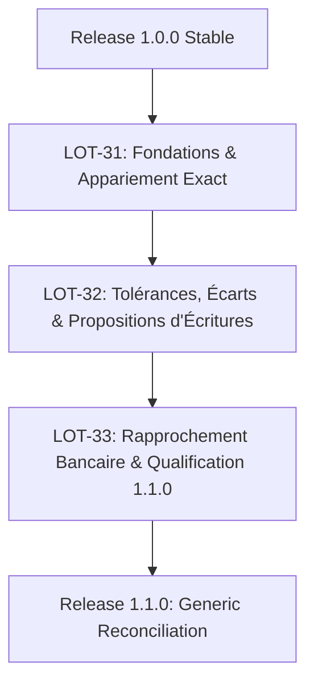

# PLAN-07 : Moteur de Réconciliation Générique & Rapprochement Bancaire (Release 1.1.0)

Ce plan d'implémentation opérationnel couvre les lots **LOT-31 à LOT-33** de la [Roadmap](../ROADMAP.md). Il formalise le moteur de réconciliation universel de PyAccountingKit, permettant l'appariement automatique multi-critères, la gestion des tolérances et la production d'états de rapprochement bancaires légalement probants.

---

## 1. Contexte & Spécifications de Référence

- **Specs applicables** :
  - Architecture de réconciliation : [`22_PYACCOUNTINGKIT_RECONCILIATION_ARCHITECTURE.md`](../specs/02_ledger-operations/22_PYACCOUNTINGKIT_RECONCILIATION_ARCHITECTURE.md)
  - Invariants comptables : [`03_PYACCOUNTINGKIT_ACCOUNTING_RULES_AND_INVARIANTS.md`](../specs/01_core-accounting/03_PYACCOUNTINGKIT_ACCOUNTING_RULES_AND_INVARIANTS.md)
  - Grand livre et auxiliaires : [`15_PYACCOUNTINGKIT_SUBLEDGERS_AND_OPERATIONAL_ACCOUNTING_ARCHITECTURE.md`](../specs/01_core-accounting/15_PYACCOUNTINGKIT_SUBLEDGERS_AND_OPERATIONAL_ACCOUNTING_ARCHITECTURE.md)
  - Architecture applicative & ports : [`01_PYACCOUNTINGKIT_PROJECT_VISION_AND_ARCHITECTURE.md`](../specs/00_cadrage/01_PYACCOUNTINGKIT_PROJECT_VISION_AND_ARCHITECTURE.md)
  - Façade API publique : [`16_PYACCOUNTINGKIT_PUBLIC_API_DESIGN.md`](../specs/04_integration-infra/16_PYACCOUNTINGKIT_PUBLIC_API_DESIGN.md)
- **Doctrine comptable & Références financières** :
  - 📖 [`Comptabilite_Generale_Systeme_Francais_et_Normes_IFRS.md`](../books/Comptabilite_Generale_Systeme_Francais_et_Normes_IFRS.md) (Technique de l'état de rapprochement bancaire, compte 512 Banque vs extrait de compte bancaire, traitement des agios et chèques non débités).
  - 📊 [`Maxi_fiches_de_Gestion_financiere_de_l_entreprise.md`](../books/Maxi_fiches_de_Gestion_financiere_de_l_entreprise.md) (Gestion de trésorerie au jour le jour, soldes en valeur et suivi des flux réels).
  - 📁 Datasets de relevés types : [`docs/referentiels/datasets/raw/`](../referentiels/datasets/raw/) (relevés bancaires et flux financiers pour étalonnage des moteurs d'appariement).
- **Invariant doctrinal cardinal** :
  > **« Reconciliation matches & explains. Posting owns accounting correction. Consolidation owns eliminations. »**

---

## 2. Inventaire des Fichiers à Implémenter & Liens Relatifs

### 2.1. Modèle de Domaine de Réconciliation (`domain/reconciliation`)
- Définition des profils et sources de données :
  - [`src/pyaccountingkit/domain/reconciliation/definitions/profile.py`](../../src/pyaccountingkit/domain/reconciliation/definitions/profile.py) (`ReconciliationDefinition`, `ReconciliationScope`)
  - [`src/pyaccountingkit/domain/reconciliation/sources/item.py`](../../src/pyaccountingkit/domain/reconciliation/sources/item.py) (`ReconciliationItem`, normalisation des montants et dates)
  - [`src/pyaccountingkit/domain/reconciliation/snapshots/source_snapshot.py`](../../src/pyaccountingkit/domain/reconciliation/snapshots/source_snapshot.py) (`SourceSnapshot`, scellement immuable des flux)
  - [`src/pyaccountingkit/domain/reconciliation/runs/run.py`](../../src/pyaccountingkit/domain/reconciliation/runs/run.py) (`ReconciliationRun`, exécution horodatée et traçable)
- Moteur d'appariement, tolérances & résolutions :
  - [`src/pyaccountingkit/domain/reconciliation/matching/policies.py`](../../src/pyaccountingkit/domain/reconciliation/matching/policies.py) (`MatchingPolicy`, appariement exact, multi-lignes $1\leftrightarrow N$, $N\leftrightarrow M$)
  - [`src/pyaccountingkit/domain/reconciliation/differences/difference.py`](../../src/pyaccountingkit/domain/reconciliation/differences/difference.py) (`ReconciliationDifference`, qualification des écarts)
  - [`src/pyaccountingkit/domain/reconciliation/resolutions/proposal.py`](../../src/pyaccountingkit/domain/reconciliation/resolutions/proposal.py) (`JournalEntryProposal`, proposition de régularisation)
  - [`src/pyaccountingkit/domain/reconciliation/controls/sign_off.py`](../../src/pyaccountingkit/domain/reconciliation/controls/sign_off.py) (`ReconciliationSignOff`, validation contradictoire)

### 2.2. Adaptateurs de Flux Externes (`adapters/reconciliation`)
- Parsers de relevés bancaires :
  - [`src/pyaccountingkit/adapters/reconciliation/bank_statement_reader.py`](../../src/pyaccountingkit/adapters/reconciliation/bank_statement_reader.py) (Ingestion CFONB, MT940, CAMT.053, CSV bancaire)

### 2.3. Suites de Tests Dédiées (`tests`)
- Tests unitaires et d'intégration :
  - [`tests/unit/domain/test_reconciliation_engine.py`](../../tests/unit/domain/test_reconciliation_engine.py)
  - [`tests/unit/domain/test_bank_reconciliation.py`](../../tests/unit/domain/test_bank_reconciliation.py)
  - [`tests/unit/domain/test_intercompany_reconciliation.py`](../../tests/unit/domain/test_intercompany_reconciliation.py)

---

## 3. Détails Techniques & Extraits de Code Concrets

### 3.1. Modèle d'Élément Normalisé (`src/pyaccountingkit/domain/reconciliation/sources/item.py`)

```python
from __future__ import annotations

from dataclasses import dataclass
from datetime import date
from typing import Any
from pyaccountingkit.core.money import Money


@dataclass(frozen=True)
class ReconciliationItem:
    """Élément unitaire issu d'une source interne (Grand Livre) ou externe (Relevé bancaire)."""

    item_id: str
    source_name: str          # ex: "BANK_ACCOUNT_512", "GL_ACCOUNT_512"
    effective_date: date
    amount: Money
    reference: str            # Numéro de chèque, référence virement, libellé
    metadata: dict[str, Any]
    allocated_amount: Money   # Déjà affecté à un rapprochement partiel

    @property
    def remaining_amount(self) -> Money:
        return self.amount - self.allocated_amount

    def is_fully_matched(self) -> bool:
        return self.remaining_amount.is_zero()
```

### 3.2. Rapprochement avec Tolérance & Proposition d'Écriture (`src/pyaccountingkit/domain/reconciliation/matching/policies.py`)

```python
from __future__ import annotations

from dataclasses import dataclass
from decimal import Decimal
from pyaccountingkit.core.money import Money
from pyaccountingkit.domain.reconciliation.sources.item import ReconciliationItem
from pyaccountingkit.domain.reconciliation.resolutions.proposal import JournalEntryProposal


@dataclass(frozen=True)
class MatchingResult:
    matched_left: list[ReconciliationItem]
    matched_right: list[ReconciliationItem]
    difference: Money
    adjustment_proposal: JournalEntryProposal | None = None


class ToleranceMatchingPolicy:
    """Rapproche deux flux autorisant un faible écart (ex: frais bancaires ou arrondi)."""

    def __init__(self, max_tolerance: Decimal, fee_account: str) -> None:
        self._max_tolerance = max_tolerance
        self._fee_account = fee_account

    def match(self, left: ReconciliationItem, right: ReconciliationItem) -> MatchingResult | None:
        diff_amount = abs(left.amount.amount - right.amount.amount)
        if diff_amount == Decimal("0.00"):
            return MatchingResult([left], [right], Money.zero(left.amount.currency))

        if diff_amount <= self._max_tolerance:
            diff_money = Money(diff_amount, left.amount.currency)
            # Génération d'une proposition d'écriture pour enregistrer les frais bancaires
            proposal = JournalEntryProposal(
                journal_code="BQ",
                entry_date=left.effective_date,
                description=f"Frais bancaires sur rapprochement {left.reference}",
                debit_account=self._fee_account,
                credit_account="512000",
                amount=diff_money,
            )
            return MatchingResult([left], [right], diff_money, proposal)
        return None
```

### 3.3. Équation de l'État de Rapprochement Bancaire

$$\text{Solde Relevé Bancaire} + \sum \text{Recettes comptabilisées non créditées} - \sum \text{Chèques émis non débités} = \text{Solde Comptable 512}$$

## 4. Ordonnancement des Lots & Dépendances

### Aperçu Schématique (Vue ASCII Textuelle)

```text
┌────────────────────────────────────────────────────────┐
│               Release 1.0.0 Stable (Socle)             │
└───────────────────────────┬────────────────────────────┘
                            │
                            ▼
┌────────────────────────────────────────────────────────┐
│      LOT-31 : Fondations & Appariement Exact (GA, GS)  │
└───────────────────────────┬────────────────────────────┘
                            │
                            ▼
┌────────────────────────────────────────────────────────┐
│      LOT-32 : Tolérances, Écarts & Résolutions (GC, GP)│
└───────────────────────────┬────────────────────────────┘
                            │
                            ▼
┌────────────────────────────────────────────────────────┐
│      LOT-33 : Rapprochement Bancaire, GL/Aux & Interco │
└───────────────────────────┬────────────────────────────┘
                            │
                            ▼
┌────────────────────────────────────────────────────────┐
│      Release 1.1.0 : Extension Réconciliation          │
└────────────────────────────────────────────────────────┘
```

### Définition Formelle Mermaid (pour viewers avec extension)



---

## 5. Matrice des Gates & Critères de Qualité

- **`GA` (Accounting Invariants Gate)** :
  - Aucune ligne comptabilisée n'est mutée directement par le rapprochement.
  - Toute régularisation transite impérativement par une écriture validée via `PostingService`.
- **`GS` (Snapshot & Audit Gate)** :
  - Le snapshot de réconciliation est scellé et produit un certificat d'audit infalsifiable.

---

## 5. Definition of Done (DoD Spécifique)

- [ ] L'appariement automatique exact résout $> 90\,\%$ des écritures bancaires courantes.
- [ ] La gestion des tolérances distingue formellement tolérance d'écart et abandon de créance.
- [ ] L'état de rapprochement bancaire certifié est exportable en PDF/JSON probant.
- [ ] Le module s'intègre à PyAccountingKit 1.0.0 sans aucune rupture de rétrocompatibilité.

---

## 6. Procédure de Recette Exécutable

```bash
# Tests du moteur de réconciliation
pytest tests/unit/domain/test_reconciliation_engine.py -v
pytest tests/unit/domain/test_bank_reconciliation.py -v
pytest tests/unit/domain/test_intercompany_reconciliation.py -v

# Typage strict
mypy src/pyaccountingkit/domain/reconciliation src/pyaccountingkit/adapters/reconciliation
```
