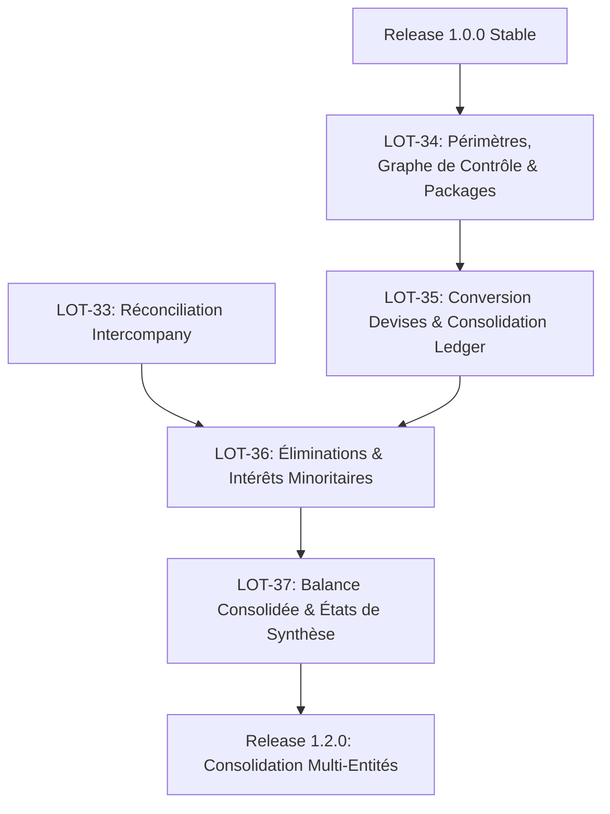

# PLAN-08 : Moteur de Consolidation Multi-Entités & Devises de Groupe (Release 1.2.0)

Ce plan d'implémentation opérationnel couvre les lots **LOT-34 à LOT-37** de la [Roadmap](../ROADMAP.md). Il formalise le sous-système de consolidation multi-entités de PyAccountingKit, permettant l'élaboration de comptes consolidés (normes IFRS / Règlement ANC 2020-01) avec conversion de devises, élimination des opérations intragroupe et suivi des intérêts minoritaires.

---

## 1. Contexte & Spécifications de Référence

- **Specs applicables** :
  - Architecture de consolidation : [`21_PYACCOUNTINGKIT_CONSOLIDATION_ARCHITECTURE.md`](../specs/03_reporting-analytics/21_PYACCOUNTINGKIT_CONSOLIDATION_ARCHITECTURE.md)
  - Analyse financière & états consolidés : [`14_PYACCOUNTINGKIT_FINANCIAL_ANALYSIS_AND_INDICATORS_ARCHITECTURE.md`](../specs/03_reporting-analytics/14_PYACCOUNTINGKIT_FINANCIAL_ANALYSIS_AND_INDICATORS_ARCHITECTURE.md)
  - Invariants comptables : [`03_PYACCOUNTINGKIT_ACCOUNTING_RULES_AND_INVARIANTS.md`](../specs/01_core-accounting/03_PYACCOUNTINGKIT_ACCOUNTING_RULES_AND_INVARIANTS.md)
  - Moteur de réconciliation intercompany : [`22_PYACCOUNTINGKIT_RECONCILIATION_ARCHITECTURE.md`](../specs/02_ledger-operations/22_PYACCOUNTINGKIT_RECONCILIATION_ARCHITECTURE.md)
  - Architecture applicative & ports : [`01_PYACCOUNTINGKIT_PROJECT_VISION_AND_ARCHITECTURE.md`](../specs/00_cadrage/01_PYACCOUNTINGKIT_PROJECT_VISION_AND_ARCHITECTURE.md)
- **Doctrine comptable & Référentiels de données** :
  - 📖 [`Comptabilite_Generale_Systeme_Francais_et_Normes_IFRS.md`](../books/Comptabilite_Generale_Systeme_Francais_et_Normes_IFRS.md) (Quatrième Partie : Comptes de groupe et consolidation, périmètre de consolidation, intégration globale, éliminations réciproques, goodwill et intérêts minoritaires).
  - 📁 Datasets réglementaires de transcodification : [`docs/referentiels/datasets/crosswalk/`](../referentiels/datasets/crosswalk/) (tables de mapping plan de comptes local $\rightarrow$ plan groupe IFRS).

---

## 2. Inventaire des Fichiers à Implémenter & Liens Relatifs

### 2.1. Périmètre & Organisation du Groupe (`domain/consolidation`)
- Structure du groupe & liens capitalistiques :
  - [`src/pyaccountingkit/domain/consolidation/group/scope.py`](../../src/pyaccountingkit/domain/consolidation/group/scope.py) (`Group`, `ConsolidationScope`, versionnage temporel)
  - [`src/pyaccountingkit/domain/consolidation/group/entity.py`](../../src/pyaccountingkit/domain/consolidation/group/entity.py) (`ConsolidationEntity`, rôle mère/filiale)
  - [`src/pyaccountingkit/domain/consolidation/group/ownership.py`](../../src/pyaccountingkit/domain/consolidation/group/ownership.py) (`OwnershipGraph`, calcul du % d'intérêt et % de contrôle)
  - [`src/pyaccountingkit/domain/consolidation/packages/package.py`](../../src/pyaccountingkit/domain/consolidation/packages/package.py) (`EntityReportingPackage`, balance locale certifiée)
  - [`src/pyaccountingkit/domain/consolidation/chart/mapping.py`](../../src/pyaccountingkit/domain/consolidation/chart/mapping.py) (`GroupChartOfAccounts`, transcodification univoque)
  - [`src/pyaccountingkit/domain/consolidation/periods/period.py`](../../src/pyaccountingkit/domain/consolidation/periods/period.py) (`ConsolidationPeriod`)

### 2.2. Conversion, Homogénéisation & Grand Livre de Groupe
- Moteur de change & retraitements :
  - [`src/pyaccountingkit/domain/consolidation/currency/translation.py`](../../src/pyaccountingkit/domain/consolidation/currency/translation.py) (`CurrencyTranslationPolicy`, cours de clôture vs moyen)
  - [`src/pyaccountingkit/domain/consolidation/currency/rates.py`](../../src/pyaccountingkit/domain/consolidation/currency/rates.py) (`ExchangeRateProvider`, snapshot des taux officiels)
  - [`src/pyaccountingkit/domain/consolidation/adjustments/adjustment.py`](../../src/pyaccountingkit/domain/consolidation/adjustments/adjustment.py) (`ConsolidationAdjustment`, retraitements d'homogénéisation)
  - [`src/pyaccountingkit/domain/consolidation/entries/entry.py`](../../src/pyaccountingkit/domain/consolidation/entries/entry.py) (`ConsolidationEntry`, écritures d'élimination en partie double)
  - [`src/pyaccountingkit/domain/consolidation/entries/ledger.py`](../../src/pyaccountingkit/domain/consolidation/entries/ledger.py) (`ConsolidationLedger`, grand livre de groupe hermétique)

### 2.3. Éliminations Intragroupe & Partage des Capitaux Propres
- Traitement des opérations réciproques et participations :
  - [`src/pyaccountingkit/domain/consolidation/intercompany/elimination.py`](../../src/pyaccountingkit/domain/consolidation/intercompany/elimination.py) (Élimination créances/dettes, CA interne, dividendes)
  - [`src/pyaccountingkit/domain/consolidation/investments/goodwill.py`](../../src/pyaccountingkit/domain/consolidation/investments/goodwill.py) (`GoodwillMeasurement`, écart d'acquisition)
  - [`src/pyaccountingkit/domain/consolidation/investments/minority.py`](../../src/pyaccountingkit/domain/consolidation/investments/minority.py) (`NonControllingInterest`, intérêts minoritaires)

### 2.4. Plaquette Consolidée & Qualification
- Production des états de groupe :
  - [`src/pyaccountingkit/domain/consolidation/runs/run.py`](../../src/pyaccountingkit/domain/consolidation/runs/run.py) (`ConsolidationRun`, calcul de la `ConsolidatedTrialBalance`)
  - [`src/pyaccountingkit/domain/consolidation/snapshots/snapshot.py`](../../src/pyaccountingkit/domain/consolidation/snapshots/snapshot.py) (`ConsolidationSnapshot`, plaquette scellée avec drill-down)
  - [`src/pyaccountingkit/domain/consolidation/controls/staleness.py`](../../src/pyaccountingkit/domain/consolidation/controls/staleness.py) (Marquage `STALE` si réouverture d'une filiale)

### 2.5. Suites de Tests Dédiées (`tests`)
- [`tests/unit/domain/test_consolidation_group.py`](../../tests/unit/domain/test_consolidation_group.py)
- [`tests/unit/domain/test_currency_translation.py`](../../tests/unit/domain/test_currency_translation.py)
- [`tests/unit/domain/test_intercompany_eliminations.py`](../../tests/unit/domain/test_intercompany_eliminations.py)
- [`tests/unit/domain/test_consolidation_statements.py`](../../tests/unit/domain/test_consolidation_statements.py)

---

## 3. Détails Techniques & Extraits de Code Concrets

### 3.1. Calcul des Pourcentages d'Intérêt et de Contrôle (`src/pyaccountingkit/domain/consolidation/group/ownership.py`)

```python
from __future__ import annotations

from dataclasses import dataclass
from decimal import Decimal
from enum import Enum


class ConsolidationMethod(str, Enum):
    FULL = "FULL"                    # Intégration globale (contrôle exclusif > 50%)
    PROPORTIONAL = "PROPORTIONAL"    # Intégration proportionnelle (contrôle conjoint 50/50)
    EQUITY = "EQUITY"                # Mise en équivalence (influence notable 20-50%)


@dataclass(frozen=True)
class OwnershipEdge:
    """Lien de détention direct de la société parente vers la filiale."""

    parent_id: str
    subsidiary_id: str
    financial_interest_pct: Decimal  # Droits financiers aux dividendes
    voting_rights_pct: Decimal       # Droits de vote


class OwnershipGraph:
    """Graphe de détention capitalistique du groupe."""

    def __init__(self, edges: list[OwnershipEdge]) -> None:
        self._edges = edges

    def determine_method(self, subsidiary_id: str) -> ConsolidationMethod:
        control_pct = self.compute_voting_control(subsidiary_id)
        if control_pct > Decimal("50.00"):
            return ConsolidationMethod.FULL
        if Decimal("20.00") <= control_pct <= Decimal("50.00"):
            return ConsolidationMethod.EQUITY
        raise ValueError(f"Participation hors périmètre pour {subsidiary_id} ({control_pct}%)")

    def compute_voting_control(self, subsidiary_id: str) -> Decimal:
        # Algorithme de parcours de graphe cumulant les droits de vote de contrôle direct et indirect
        ...
```

### 3.2. Écriture d'Élimination Intragroupe (`src/pyaccountingkit/domain/consolidation/intercompany/elimination.py`)

```python
from __future__ import annotations

from pyaccountingkit.core.money import Money
from pyaccountingkit.domain.consolidation.entries.entry import ConsolidationEntry, ConsolidationLine


class IntercompanyEliminationService:
    """Élimine les créances et dettes réciproques entre filiales du groupe."""

    @staticmethod
    def eliminate_reciprocal_balance(
        parent_account: str,
        subsidiary_account: str,
        amount: Money,
        description: str,
    ) -> ConsolidationEntry:
        # Écriture en partie double dans le grand livre de consolidation
        lines = (
            ConsolidationLine(account=subsidiary_account, debit=amount, credit=Money.zero(amount.currency)),
            ConsolidationLine(account=parent_account, debit=Money.zero(amount.currency), credit=amount),
        )
        return ConsolidationEntry(description=description, lines=lines)
```

## 4. Ordonnancement des Lots & Dépendances

### Aperçu Schématique (Vue ASCII Textuelle)

```text
┌────────────────────────────────────────────────────────┐
│               Release 1.0.0 Stable (Socle)             │
└───────────────┬────────────────────────┬───────────────┘
                │                        │
                ▼                        │
┌───────────────────────────────┐        │
│ LOT-34 : Périmètres, Graphe   │        │
│ de Contrôle & Packages (GA)   │        │
└───────────────┬───────────────┘        │
                │                        │
                ▼                        │
┌───────────────────────────────┐        ▼
│ LOT-35 : Conversion Devises   │ ┌───────────────────────────────┐
│ & Grand Livre Conso (GC, GP)  │ │ LOT-33 : Réconciliation       │
└───────────────┬───────────────┘ │ Intercompany Réciproque (1.1) │
                │                 └──────────────┬────────────────┘
                └─────────────────┬──────────────┘
                                  │
                                  ▼
┌────────────────────────────────────────────────────────┐
│ LOT-36 : Éliminations, Titres & Minoritaires (GC, GP)  │
└───────────────────────────┬────────────────────────────┘
                            │
                            ▼
┌────────────────────────────────────────────────────────┐
│ LOT-37 : Balance Consolidée & Plaquette de Groupe      │
└───────────────────────────┬────────────────────────────┘
                            │
                            ▼
┌────────────────────────────────────────────────────────┐
│      Release 1.2.0 : Consolidation Multi-Entités       │
└────────────────────────────────────────────────────────┘
```

### Définition Formelle Mermaid (pour viewers avec extension)



---

## 5. Matrice des Gates & Critères de Qualité

- **`GA` (Group Invariants Gate)** :
  - Tous les ajustements de consolidation respectent la partie double $\sum Débit = \sum Crédit$.
  - Les grands livres individuels des filiales ne subissent aucune mutation.
- **`GC` (Currency Translation Gate)** :
  - Les écarts de conversion issus de l'application des cours de clôture vs cours historiques sont strictement isolés en capitaux propres consolidés.

---

## 5. Definition of Done (DoD Spécifique)

- [ ] L'arbre de consolidation calcule fidèlement les pourcentages d'intérêt et de contrôle sur des structures capitalistiques complexes à plusieurs niveaux.
- [ ] La balance générale consolidée est rigoureusement équilibrée.
- [ ] L'égalité : $\text{Résultat net consolidé} = \text{Part du Groupe} + \text{Part des minoritaires}$ est vérifiée au centime près.
- [ ] Le mécanisme de drill-down permet de tracer chaque chiffre de la plaquette de groupe jusqu'à l'écriture comptable d'origine de la filiale.

---

## 6. Procédure de Recette Exécutable

```bash
# Tests du moteur de consolidation multi-entités
pytest tests/unit/domain/test_consolidation_group.py -v
pytest tests/unit/domain/test_currency_translation.py -v
pytest tests/unit/domain/test_intercompany_eliminations.py -v
pytest tests/unit/domain/test_consolidation_statements.py -v

# Typage strict
mypy src/pyaccountingkit/domain/consolidation
```
