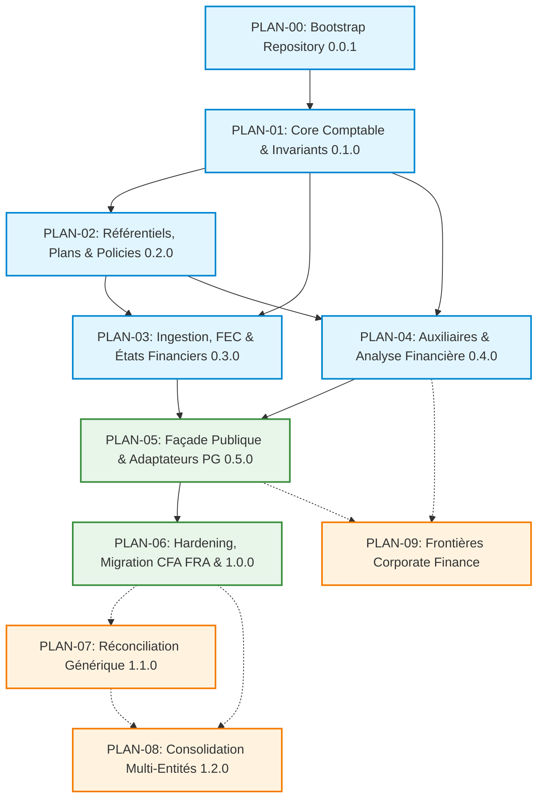

# Index des Plans d'Implémentation Opérationnels — PyAccountingKit

Ce dossier regroupe les **plans d'implémentation modulaires et opérationnels** issus du découpage exhaustif de la feuille de route doctrinale ([`ROADMAP.md`](../ROADMAP.md)).

Chaque plan correspond à un jalon de release sémantique clair, définit les lots techniques couverts (parmi les 39 lots `LOT-00` à `LOT-38`), les spécifications de référence, les dépendances amont, les critères de validation stricts (**DoD**) et les scénarios de recette.

---

## 1. Vue d'Ensemble des Plans d'Implémentation

| Plan | Intitulé & Périmètre | Lots Couverts | Release Cible | Statut & Prérequis |
| :--- | :--- | :--- | :--- | :--- |
| [`PLAN-00`](PLAN-00_REPOSITORY_BOOTSTRAP_0.0.1.md) | **Bootstrap du Repository & Outillage CI/CD** | `LOT-00` | `0.0.1` | Fondations techniques (G0) |
| [`PLAN-01`](PLAN-01_ACCOUNTING_CORE_0.1.0.md) | **Moteur Comptable Central & Invariants** | `LOT-01..09` | `0.1.0` | Prérequis : PLAN-00 |
| [`PLAN-02`](PLAN-02_REFERENCES_CHARTS_POLICIES_0.2.0.md) | **Référentiels, Plans Comptables & Policies** | `LOT-10..13` | `0.2.0` | Prérequis : PLAN-01 |
| [`PLAN-03`](PLAN-03_IMPORTS_REPORTING_0.3.0.md) | **Ingestion, FEC & États Financiers** | `LOT-14..17` | `0.3.0` | Prérequis : PLAN-01, PLAN-02 |
| [`PLAN-04`](PLAN-04_SUBLEDGERS_FINANCIAL_ANALYSIS_0.4.0.md) | **Comptes Auxiliaires & Analyse Financière** | `LOT-18..20` | `0.4.0` | Prérequis : PLAN-01, PLAN-02 |
| [`PLAN-05`](PLAN-05_PUBLIC_API_ADAPTERS_0.5.0.md) | **Façade Publique & Adaptateurs PostgreSQL** | `LOT-21..24` | `0.5.0` | Prérequis : PLAN-01..04 |
| [`PLAN-06`](PLAN-06_MIGRATION_CFA_FRA_HARDENING_1.0.0.md) | **Hardening, Migration CFA FRA & Release 1.0.0** | `LOT-25..30` | `1.0.0` | Prérequis : PLAN-05 (G5) |
| [`PLAN-07`](PLAN-07_RECONCILIATION_1.1.0.md) | **Réconciliation Générique & Rapprochement Bancaire** | `LOT-31..33` | `1.1.0` | Extension post-1.0 |
| [`PLAN-08`](PLAN-08_CONSOLIDATION_1.2.0.md) | **Consolidation Multi-Entités & Devises** | `LOT-34..37` | `1.2.0` | Extension post-1.0 |
| [`PLAN-09`](PLAN-09_CORPORATE_FINANCE_BOUNDARIES.md) | **Garde-fous & Frontières Corporate Finance** | `LOT-38` | Phase P2.3 | Transversal & Continu |

---

## 2. Graphe d'Ordonnancement & Chemin Critique

### Aperçu Schématique (Vue ASCII Textuelle)

```text
┌──────────────────────────────────────────────────────────────────┐
│              PLAN-00 : Bootstrap Repository (0.0.1)              │
└────────────────────────────────┬─────────────────────────────────┘
                                 │
                                 ▼
┌──────────────────────────────────────────────────────────────────┐
│           PLAN-01 : Core Comptable & Invariants (0.1.0)          │
└──────────────┬─────────────────┬─────────────────┬───────────────┘
               │                 │                 │
               ▼                 │                 │
┌──────────────────────────────┐ │                 │
│ PLAN-02 : Référentiels,      │ │                 │
│ Plans & Policies (0.2.0)     │ │                 │
└──┬───────────────────────┬───┘ │                 │
   │                       │     │                 │
   │         ┌─────────────┼─────┘                 │
   │         │             │                       │
   ▼         ▼             ▼                       ▼
┌────────────────────────┐ ┌───────────────────────────────────────┐
│ PLAN-03 : Ingestion,   │ │ PLAN-04 : Comptes Auxiliaires         │
│ FEC & Reporting (0.3.0)│ │ & Analyse Financière (0.4.0)          │
└────────────┬───────────┘ └───────┬───────────────────────────────┘
             │                     │               :
             │       ┌─────────────┘               :
             ▼       ▼                             ▼
┌───────────────────────────────────────┐   ┌──────────────────────┐
│ PLAN-05 : Façade Publique             │:::> PLAN-09 : Garde-fous │
│ & Adaptateurs PostgreSQL (0.5.0)      │   │ Corporate Finance    │
└──────────────────┬────────────────────┘   │ (P2.3 / Continu)     │
                   │                        └──────────────────────┘
                   ▼
┌──────────────────────────────────────────────────────────────────┐
│ PLAN-06 : Hardening, Migration CFA FRA & Release 1.0.0           │
└──────────────┬───────────────────────────────────────────────────┘
               : (Extensions post-1.0)
       ........:........................
       :                               :
       ▼                               ▼
┌──────────────────────────────┐       ┌───────────────────────────┐
│ PLAN-07 : Réconciliation     │......>│ PLAN-08 : Consolidation   │
│ Générique & Banque (1.1.0)   │       │ Multi-Entités (1.2.0)     │
└──────────────────────────────┘       └───────────────────────────┘
```

### Définition Formelle Mermaid (pour viewers avec extension)



---

## 3. Système des Portes de Qualité (Gates)

Chaque lot et chaque plan doit valider formellement une ou plusieurs gates avant tout merge ou transition d'état :

### Gates Générales de Release
- **`G0` (Hygiène)** : Linter Ruff, typage Mypy strict, formattage déterministe, import-guards.
- **`G1` (Domaine pur)** : Tests unitaires purs en mémoire sans I/O ni dépendance externe.
- **`G2` (Adaptateurs in-memory)** : Validation des contrats de persistance sur implémentation mock / in-memory.
- **`G3` (Adaptateurs réels)** : Validation sur PostgreSQL réel (testcontainers), gestion des verrous et concurrence.
- **`G4` (Stabilité des API & Non-régression)** : Parité de comportement, non-régression de l'arbre d'API.
- **`G5` (Release Candidate & Production)** : Zero bug critique, documentation complète, packaging reproductible.

### Gates Métier Spécialisées
- **`GA` (Accounting Invariants)** : Équilibre partie double débit=crédit, immuabilité après posting, traçabilité des contrepassations.
- **`GC` (Currency & Rounding)** : Exactitude de la classe `Money`, absence d'arrondi intermédiaire flottant, conservation des centimes.
- **`GP` (Posting & Concurrency)** : Résistance aux courses critiques (concurrence de comptabilisation vs clôture).
- **`GR` (Regulatory Compliance)** : Validation face aux formats légaux (FEC, règles OHADA, schémas PCG).
- **`GI` (Immutability & Audit)** : Impossibilité de muter une écriture comptabilisée ou un snapshot certifié.
- **`GS` (Snapshot & Replay)** : Capacité de rejouer des années d'historique et de recalculer les états sans variation.
- **`GAPI` (Public API Surface)** : Vérification de non-fuite d'ORM ou d'entités internes mutables.
- **`GM` (Migration Parity)** : Égalité stricte avec les résultats de l'ancien moteur CFA FRA.
- **`GSEC` (Security & Supply Chain)** : Absence de dépendances vulnérables, audit SAST, génération de SBOM.

---

## 4. Organisation des Dossiers, Ouvrages & Référentiels

### 4.1. Structure Générale & Spécifications
- Centre de documentation racine : [`../README.md`](../README.md)
- Feuille de route globale : [`../ROADMAP.md`](../ROADMAP.md)
- Spécifications canoniques : [`../specs/README.md`](../specs/README.md)
  - Cadrage & Vision : [`../specs/00_cadrage/`](../specs/00_cadrage/)
  - Cœur Comptable : [`../specs/01_core-accounting/`](../specs/01_core-accounting/)
  - Opérations du Grand Livre : [`../specs/02_ledger-operations/`](../specs/02_ledger-operations/)
  - Reporting & Analyses : [`../specs/03_reporting-analytics/`](../specs/03_reporting-analytics/)
  - Intégration & Infra : [`../specs/04_integration-infra/`](../specs/04_integration-infra/)
  - Ingénierie & Gouvernance : [`../specs/05_engineering-governance/`](../specs/05_engineering-governance/)

### 4.2. Ouvrages de Référence Doctrinale (`docs/books/`)
- 📖 **[Comptabilité générale : Système français et normes IFRS](../books/Comptabilite_Generale_Systeme_Francais_et_Normes_IFRS.md)** (J. Richard, C. Collette — Dunod) : source académique cardinale pour la partie double, les invariants, la théorie de la clôture, l'évaluation et les comptes de groupe consolidés.
- 📊 **[Maxi fiches de Gestion financière de l'entreprise](../books/Maxi_fiches_de_Gestion_financiere_de_l_entreprise.md)** (Dunod) : source de référence pour les Soldes Intermédiaires de Gestion (SIG), le BFR d'exploitation, le FRNG, la CAF, les ratios de liquidité/solvabilité et les frontières Corporate Finance.

### 4.3. Référentiels Réglementaires & Schémas JSON (`docs/referentiels/`)
- 🏛️ **[Jeux de données réglementaires](../referentiels/datasets/)** : datasets officiels structurés (`concepts/`, `raw/`, `structured/`, `crosswalk/`, `reporting/`, `relations/`).
- 📐 **[Schémas JSON de validation](../referentiels/schemas/)** : contrats formels de standards comptables ([`standard.schema.json`](../referentiels/schemas/standard.schema.json), [`accounting-concept.schema.json`](../referentiels/schemas/accounting-concept.schema.json), [`concept-binding.schema.json`](../referentiels/schemas/concept-binding.schema.json), [`standard-relation.schema.json`](../referentiels/schemas/standard-relation.schema.json)).

### 4.4. Actifs Amont & Applications Consommatrices (`resources/`)
- 🏛️ **[CFA FRA Django MVP Sprint 7](../../resources/cfa_fra_django_mvp_sprint_7/)** : application historique de production servant d'**oracle comportemental** (*Behavioral Oracle*), de source des fixtures golden réelles pour la qualification de parité au centime près (`PLAN-06`), et de modèle cible pour l'adaptateur Django/PostgreSQL (`PLAN-05`).
- 📦 **[Regulatory Accounting Data Framework](../../resources/regulatory-accounting-data-framework/)** : framework source amont de données normatives (v0.7.1 - PCG 2026, SYSCOHADA, OHADA EBNL 2023, CEMAC) qui alimente et valide les schémas et datasets de [`docs/referentiels/`](../referentiels/).

### 4.5. Matrice d'Alimentation Doctrinale, Réglementaire & Ressources des Plans

| Plan d'Implémentation | Ouvrages Doctrinales (`docs/books/`) | Référentiels & Schémas (`docs/referentiels/`) | Actifs Amont (`resources/`) |
| :--- | :--- | :--- | :--- |
| **`PLAN-00` (Bootstrap)** | *Comptabilité Générale* (Intangibilité des journaux) | Schémas & Datasets (Validation dès l'amont) | [`resources/`](../../resources/) (Fixtures initiales) |
| **`PLAN-01` (Core)** | *Comptabilité Générale & IFRS* (Partie 1 : Partie double, journal, grand livre, clôture) | Étanche aux juridictions | — |
| **`PLAN-02` (Référentiels)** | *Comptabilité Générale & IFRS* (Nomenclatures, évaluation) | Schémas `standard`, `accounting-concept`, `concept-binding` & Datasets `concepts`, `structured` | [`regulatory-accounting-data-framework`](../../resources/regulatory-accounting-data-framework/) (Forge source) |
| **`PLAN-03` (Reporting)** | *Comptabilité Générale & IFRS* (Bilan, Compte de résultat, Flux) | Datasets `reporting/` | — |
| **`PLAN-04` (Analyse)** | *Maxi Fiches Gestion Financière* (SIG, CAF, FRNG, BFR, DSO, DPO) & *Comptabilité Générale* | Datasets `reporting/` (Regroupements de comptes) | — |
| **`PLAN-05` (API & Adapters)** | *Comptabilité Générale & IFRS* (Intégrité du domaine) | Schémas de validation d'API | [`cfa_fra_django_mvp_sprint_7/apps/`](../../resources/cfa_fra_django_mvp_sprint_7/apps/) (Modèles Django de référence) |
| **`PLAN-06` (Hardening 1.0.0)** | *Comptabilité Générale & IFRS* (Parité légale) | Datasets `raw/` et `structured/` | [`cfa_fra_django_mvp_sprint_7`](../../resources/cfa_fra_django_mvp_sprint_7/) (Oracle de parité & Golden fixtures) |
| **`PLAN-07` (Réconciliation)** | *Comptabilité Générale* (Compte 512) & *Maxi Fiches* (Trésorerie) | Datasets `raw/` (Extraits bancaires réels) | — |
| **`PLAN-08` (Consolidation)** | *Comptabilité Générale & IFRS* (Partie 4 : Comptes de groupe, éliminations, goodwill) | Datasets `crosswalk/` (Transcodification) | — |
| **`PLAN-09` (Frontières Corp Fin)** | *Maxi Fiches Gestion Financière* (Exclusion de DCF, WACC, LBO) | Schémas stricts de non-contamination | — |
